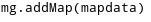
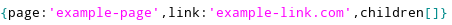
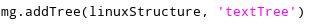

(Update: Only works in Chrome)
<h2>Introduction</h2>
Library landing page: https://young-sierra-51618.herokuapp.com/
	
Welcome! Easy Tree is a web Javascript library that started off as a quick way for developers to add a more intuitive site navigation tool for users. It became apparent that this functionality could be broadened to help developers render a variety of interactive tree diagrams.   This site has a few pages: - Getting starting: provides a guide to what is required to use this library - API: describes in more detail how to use the library - Examples: provides 3 example use cases for this library
<h3>Description of Library</h3>

This library generally allows developers to define any tree structure they would like, and for each node, include text and a site url or image link. With this, the library will automatically render a diagram of the tree in an overlay of the site.
 

The rendered diagrams are made suitable for large tree structures with these features: - Scroll allows users to adjust zoom on the diagram - text size remains constant regardless of zoom - resource size scales with zoom to allow for only node text

<h2>Getting Started</h2>	

To use this library you must include the <a href='easyTree.js'>Easy Tree</a> library along with <a href = 'https://ajax.googleapis.com/ajax/libs/jquery/3.5.1/jquery.min.js'>jQuery</a> in your project. There are three steps to rendering a tree diagram.

The first step, after including all the required files, is to declare an instance of the library like this:

The next step is to create a tree object similar to this: 

And finally you must call a function to render the object you defined:

And that will create a button that will open the diagram when clicked. To get a better sense of what this looks like check out the examples page. For more details on using the library visit the API page.

	<h2>API</h2>
	

To initialize the library you must declare an instance:

Once this is done there are three main interactions you can have with this library:

- Defining a tree structure to be rendered

- Rendering a tree as a site map diagram (function addMap)

- Rendering and linking a defined tree structure to an element click (function addTree)

<h3>Defining a tree structure</h3>

The library expects a list of nodes. There are 3 attributes a node can have:

1. page - this is the name of the node, and will appear in any rendered diagram

2. link (optional) - string link to an image or website

3. children (optional) - expects an array of node objects (leaf node indicated with null or no 'children' attribute)

Example node object:

Example tree structure:

	

<h3>addMap(struct) - Rendering as a Site Map</h3>

Once a tree structure is defined, rendering a diagram is very straightforward.

If a defined tree structure (for instance in a variable named 'mapdata') is meant as a site navigation map with library instance (for instance named 'mg'), the following command will render a button in the top right corner of the page that will bring up the map in an overlay when clicked:

<h3>addTree(struct, elementID) - Link Render to HTML Element</h3>

This command is if you would like to add a tree diagram within the sites contents. 
	To do this you must also provide the HTML element ID of the element thatwill bring up the diagram when clicked. For instance, if we want to render a structure 'linuxStructure' when a user clicks on an html element with ID 'textTree', we would call the following: 

The rendered diagram will be given the name of the innerHTML of the linked button.

